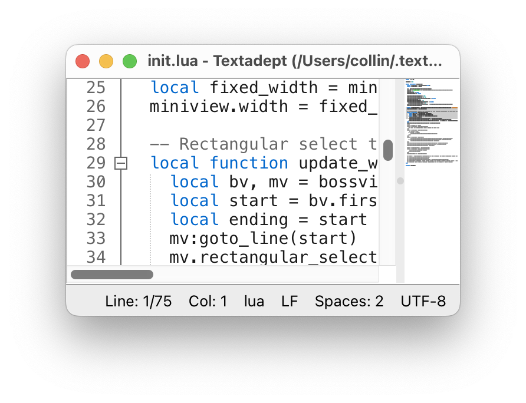

# Minimap

Minimap is a textadept module that helps you zoom out on your code and see the big picture.

Install this module by copying it into your ~/.textadept/modules/ directory or Textadept's modules/ directory.



To add a minimap of the current view:

```lua
map = require("minimap")
map()
-- or map it to a keybinding
keys['cmd+M'] = function () map() end
```

Only one instance of minimap is needed to configure multiple minimap views, they should function independently from each other.

The minimap will track whatever buffer is open in its boss view, highlighting the currently visible lines.

## Known bugs
- Closing either the boss view or minimap crashes Textadept (doesn't clean up references yet). Reset Lua before you unsplit.
- The boss view has to be focused to update the scrolled range in the minimap.
- Hotspot clicks always take you to the same incorrect spot.
