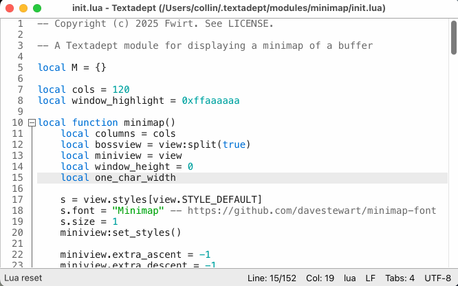

# Minimap

Minimap is a textadept module that helps you zoom out on your code and see the big picture.

Install this module by copying it into your ~/.textadept/modules/ directory or Textadept's modules/ directory.



To add a minimap of the current view:

```lua
map = require("minimap")
map()
-- or map it to a keybinding
keys['cmd+M'] = function () map() end
```
Only one instance of minimap is needed to configure multiple minimap views, they will function independently from each other.

The minimap will track whatever buffer is open in its boss view, highlighting the currently visible lines.

Click on the minimap to jump to the corresponding section of the main buffer.

## Notes

Performance may be poor on large buffers due to the fact that Scintilla is software rendering the entire buffer, just at a tiny size.
If this happens to you, try making the minimap smaller. I may include some options in the future to improve performance.

## Known bugs
- The boss view has to be focused to update the scrolled range in the minimap.
  - This is either a Scintilla or Textadept bug, an unfocused view does not emit UPDATE_UI events.
- The minimap does not always close properly if views are unsplit in a strange order.
- Prevents switching to the output buffer automatically
  - I think this is because the Output Buffer tries to open in the minimap split but the minimap blocks buffer switching.
